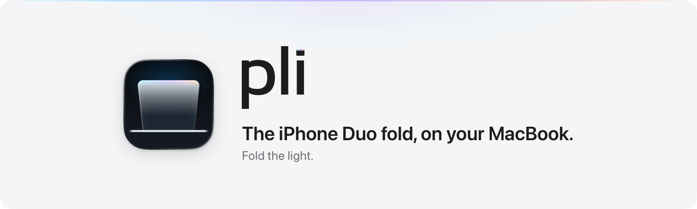
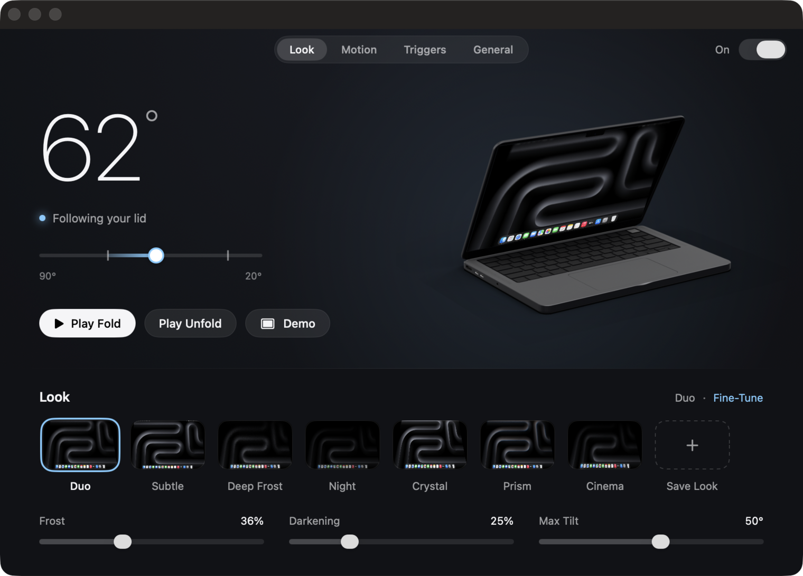

<p align="center">
  <picture>
    <source media="(prefers-color-scheme: dark)" srcset="docs/brand/readme-header-dark.png">
    
  </picture>
</p>

<p align="center">
  <a href="LICENSE"></a>
  
  
  <a href="https://github.com/ruben4reall/pli/actions/workflows/ci.yml"></a>
</p>

# Pli

**The iPhone Duo fold, on your MacBook.**

[Website](https://getpli.vercel.app) · [Download for Mac](https://github.com/ruben4reall/pli/releases/latest/download/Pli.dmg) · [Changelog](CHANGELOG.md)

*pli* is French for *fold*. Close your MacBook's lid and your desktop turns into a pane of frosted glass that swings on the hinge while the picture stays still in space. Open it, and everything unfolds.

Pli is a free, open source menu bar app for macOS 26. Fold the light.

<p align="center">
  
</p>

## What it does

- **It follows your hand.** The real angle of your MacBook's lid drives the effect: stop halfway and it stops; open again and it unwinds exactly. The screen fades to full black before the display turns off.
- **It unfolds on wake.** After sleep, your wallpaper unfolds out of black over the lock screen as you open the lid, and your desktop emerges from the frost once you unlock. Your desktop never shows before you unlock.
- **It stays out of your way.** Pli learns where your lid rests, so adjusting it by a few degrees never frosts the screen, and opening it wider never does anything. Every click and key goes through.
- **A demo and an animated lock.** ⌃⌥⌘P plays the fold without touching the lid. ⌃⌥⌘L folds, locks your Mac, and unfolds your wallpaper on the lock screen.
- **Every parameter, with a live preview.** Frost, grain, darkening, tint, saturation, edge sheen, prism, perspective and motion, each with its unit, previewed by the real engine. Seven presets (Duo, Subtle, Deep Frost, Night, Crystal, Prism, Cinema), your own, and `.pli` files to share them.
- **Native, and dark.** One Swift and SwiftUI app: a live lid symbol in the menu bar, and one dark Settings window where a 3D MacBook moves with your lid and shows the effect on its own display. Full keyboard and VoiceOver support. It follows Reduce Motion and renders lighter in Low Power Mode.
- **Light on your Mac.** About 16 MB of memory while it waits, under half a percent of one core (it reads the lid ten times a second), about 100 MB more for the second a fold lasts. Settings, General shows the memory Pli uses right now.

## Install

### Download

1. [Download Pli](https://github.com/ruben4reall/pli/releases/latest/download/Pli.dmg), open the disk image and drag Pli to Applications.
2. Open Pli from Applications. It lives in the menu bar, and a short welcome asks for the one permission it uses.

Releases are signed with a Developer ID and notarized by Apple: macOS only asks you to confirm opening an app downloaded from the internet.

### Homebrew

```sh
brew install --cask ruben4reall/tap/pli
```

### Updates

Pli updates itself with [Sparkle](https://sparkle-project.org). On its second launch, it asks whether to check for updates automatically; you can also choose *Check for Updates…* in the menu bar panel, and change your mind in Settings, General. Every update is signed with Pli's own key and with its Developer ID, and notarized by Apple. Pli updates itself only from Applications.

### Uninstall

Turn off *Open at Login* in Settings, General, quit Pli from the menu bar panel, and move it to the Trash. Its settings are in `~/Library/Preferences/ch.rubencatalao.pli.plist` and its presets in `~/Library/Application Support/Pli`. With Homebrew: `brew uninstall --cask --zap pli`.

## Permissions

- **Screen Recording**, for the frosted glass. When the lid starts to close (or you play the demo), Pli takes one picture of your built-in display, without the cursor and without Pli's own windows. The picture stays in memory, on the graphics card: it is never written to disk, never leaves your Mac, and Pli lets go of it a second after the lid rests. macOS asks you to confirm this permission again every month. Without it, Pli uses Basic mode: the system blur rises with the fold, and the settings that need the picture (Grain, Prism, Edge Sheen, Tint, Saturation and the perspective) wait for the permission.
- **Nothing else.** The lid angle sensor needs no permission. The shortcuts use the standard hot key API, so no Accessibility access. *Open at Login* shows in System Settings, General, Login Items.

## Privacy

- The picture of your screen stays in memory (see Permissions).
- No telemetry, no analytics, no crash reports, no account.
- One network connection: the update check. If you allow automatic checks, or choose *Check for Updates…*, Sparkle reads the update feed at getpli.vercel.app and downloads new versions from GitHub. Nothing else about you or your Mac is sent: Sparkle's system profile is off.
- Pli's log holds numbers and states (angles, durations), never an image.

[SECURITY.md](SECURITY.md) lists everything Pli touches on your Mac.

## Compatible Macs

- macOS 26 or later.
- **The fold follows the lid** on MacBooks with a lid angle sensor, which arrived with the 16-inch MacBook Pro of 2019. Tested on a 14-inch MacBook Pro with M3 Pro; expected on the other Apple silicon MacBook Pro and on the MacBook Air from M2. Other projects report that it cannot be read on some M1 and M2 models (the M1 MacBook Air and the 13-inch MacBook Pro with Touch Bar among them). Pli checks at launch: Settings, General, This Mac says "Folds with your lid" or "Shortcuts only".
- **On every Mac**, desktop Macs included: the demo (⌃⌥⌘P), the animated lock (⌃⌥⌘L) and the unfold after you unlock play on the built-in display, or on the main display of a Mac without one.
- Pli is a universal app, tested on Apple silicon. It builds for Intel Macs but has not been tested on one.
- External displays are never touched. With your MacBook closed on an external display, Pli pauses.

## Private macOS APIs

Pli uses private macOS functions for three features. All of them are looked up at runtime in one file,
`Packages/PliKit/Sources/PliSystem/PrivateAPI.swift`: if a macOS update removes one, its feature turns off and
nothing crashes.

| Feature | Functions | Why |
|---|---|---|
| Unfold on the lock screen | `SLSMainConnectionID`, `SLSSpaceCreate`, `SLSSpaceSetAbsoluteLevel`, `SLSShowSpaces`, `SLSSpaceAddWindowsAndRemoveFromSpaces` (SkyLight) | Only a window in a space at lock screen level can draw above the lock screen. It only ever shows your wallpaper. Technique from [Lakr233/SkyLightWindow](https://github.com/Lakr233/SkyLightWindow) (MIT). |
| Animated lock | `SACLockScreenImmediate` (login.framework) | Locks the Mac at the end of the fold. |
| Hide the cursor during the effect | `CGSMainConnectionID`, `CGSSetConnectionProperty` ("SetsCursorInBackground") | macOS lets only the frontmost app hide the cursor, and Pli stays in the background. |

## Build from source

You need macOS 26, Xcode 26.5 and XcodeGen.

```sh
brew install xcodegen
git clone https://github.com/ruben4reall/pli.git
cd pli
swift test --package-path Packages/PliKit   # the engine and the app's logic
scripts/build.sh                             # prints the path of the Debug app
open .build/xcode/Build/Products/Debug/Pli.app
```

- Builds are signed ad hoc, so macOS asks for the Screen Recording permission again after each rebuild. `PLI_TEAM_ID=<your Apple team ID> scripts/build.sh` signs with your Apple Development certificate instead, and the permission stays.
- Ad hoc builds run without the hardened runtime: macOS would refuse to load the Sparkle framework into ad hoc code with it. Team-signed Release builds keep it, like the published app.
- `open -n --env PLI_LID_SIMULATOR=1 .build/xcode/Build/Products/Debug/Pli.app` replaces the lid with a simulator in a Debug menu, so you can try everything without moving the lid.
- `scripts/release.sh` makes a disk image. Without `PLI_TEAM_ID` it is ad hoc, for your own use; with a team it is signed, notarized and stapled.

## Credits

- The optical model, glass swinging on the hinge while the picture stays still, follows the description by [marcoazeem/duo-open](https://github.com/marcoazeem/duo-open) (MIT) and [Atomicx7/Duo-animation](https://github.com/Atomicx7/Duo-animation). Pli's shader is written from scratch.
- The window above the lock screen uses the SkyLight technique of [Lakr233/SkyLightWindow](https://github.com/Lakr233/SkyLightWindow) (MIT), rewritten.
- The lid angle sensor was found and documented by [samhenrigold/LidAngleSensor](https://github.com/samhenrigold/LidAngleSensor).
- Updates by [Sparkle](https://sparkle-project.org) (MIT).

Licenses and notices: [THIRD-PARTY-NOTICES.md](THIRD-PARTY-NOTICES.md).

## Contributing

Questions, ideas and `.pli` looks to share go to [Discussions](https://github.com/ruben4reall/pli/discussions); bugs to [issues](https://github.com/ruben4reall/pli/issues). Pull requests are welcome: [CONTRIBUTING.md](CONTRIBUTING.md) gives the workflow and the promises every change keeps, and [SECURITY.md](SECURITY.md) how to report a vulnerability privately. The code is Swift: `Packages/PliKit` (the engine, the macOS adapters and the app's logic, all tested with `swift test`) and a thin app target that XcodeGen generates from `project.yml`.

## License

MIT. See [LICENSE](LICENSE).

Pli is not affiliated with Apple. iPhone, MacBook and macOS are trademarks of Apple Inc.
