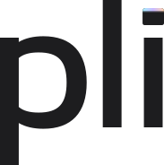
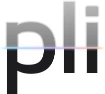
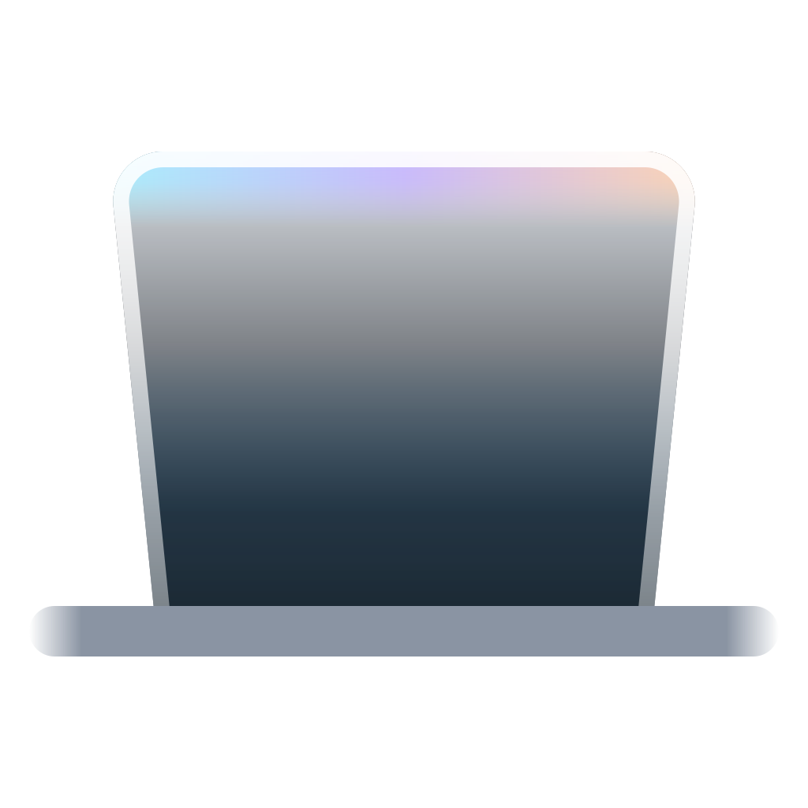
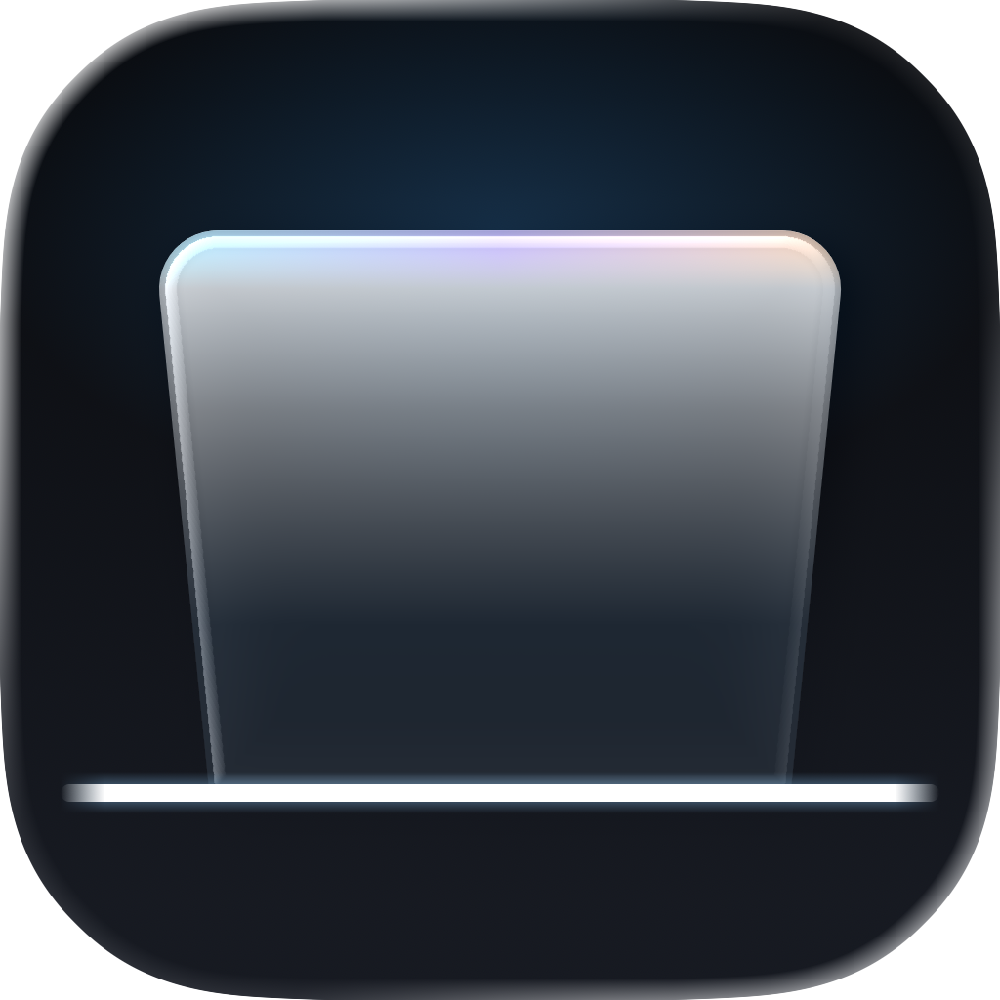

<picture>
  <source media="(prefers-color-scheme: dark)" srcset="readme-header-dark.png">
  
</picture>

# Pli brand guide

The reference for everything that carries the Pli name: the app, the website, the README, release notes and launch images. Direction A, "Glass": Apple-like, calm, light-first.

Every asset is authored as source under [`brand/`](../../brand) and rendered by a script, so it can be rebuilt and reviewed. When this guide and a file disagree, the tokens in [`brand/tokens/tokens.json`](../../brand/tokens/tokens.json) win.

## Platform

| | |
|---|---|
| **Name** | Pli. In text, capitalized like a name: "Pli". In the wordmark, lowercase: "pli". |
| **Meaning** | *Pli* is French for *fold*. The README and the website say so once, in one line. |
| **Tagline** | The iPhone Duo fold, on your MacBook. |
| **Signature line** | Fold the light. |
| **With the name** | Pli · The iPhone Duo fold, on your MacBook. |
| **Personality** | Calm, precise, tactile, a touch poetic. Swiss craftsmanship. Native to the Mac without imitating Apple. |
| **Voice** | Short, sensory sentences. Second person. No superlatives. Exact numbers. |

The tagline and the signature line are always set as text, never drawn into a logo.

### Voice

| Do | Don't |
|---|---|
| Close the lid. Your desktop turns to frosted glass and swings on the hinge. | The most stunning fold animation ever made for the Mac! |
| Under 2 ms of GPU time per frame. | Blazing fast and super lightweight. |
| The picture stays in memory. It never touches the disk and never leaves your Mac. | We take your privacy very seriously. |
| Open it, and everything unfolds. | Unleash the power of folding. |
| Pli needs Screen Recording permission to see your desktop. | Just grant a few permissions and you're good to go! |
| Lid at 104°. Frosted at 20°. | Lid at around a hundred degrees or so. |

- Headlines and body text in sentence case. App interface labels in title case, as macOS does ("Play Fold", "Show Welcome Again").
- Every value with its unit: 104°, 45 ms, 0.8 s, 30%.
- No em dashes in visible text: use a colon, a comma or a new sentence.
- Everything in English.
- Wherever Pli is presented (README, website, About window), add: "Pli is not affiliated with Apple. iPhone and MacBook are trademarks of Apple Inc."

## Logo

### Wordmark

<picture>
  <source media="(prefers-color-scheme: dark)" srcset="../../brand/wordmark/pli-wordmark-ice.svg">
  
</picture>

A custom lowercase "pli". The dot of the i is a small pane of glass whose top edge catches the iridescent light, as the pane does on the app icon. It is drawn as outlines: never retype it in a font.

| File | Use |
|---|---|
| [`brand/wordmark/pli-wordmark-ink.svg`](../../brand/wordmark/pli-wordmark-ink.svg) | Ink letters, for White, Paper and Ice backgrounds |
| [`brand/wordmark/pli-wordmark-ice.svg`](../../brand/wordmark/pli-wordmark-ice.svg) | Ice letters, for Night and Slate backgrounds |

- **Clear space:** keep free space equal to the x-height (the height of the "p" bowl, 54% of the wordmark's height) on every side. A 48 px tall wordmark needs 26 px around it.
- **Minimum size:** 20 px tall on screen, 5 mm in print. Below about 48 px the pane's lit edge becomes a plain dot, as intended.
- **Proportions:** 183.5 × 184 units (x-height 100). Scale it only uniformly.

### Motion wordmark (secondary)

<picture>
  <source media="(prefers-color-scheme: dark)" srcset="../../brand/wordmark/pli-wordmark-crease-ice.svg">
  
</picture>

The same letters crossed by the fold line at half the x-height: frosted above, sharp below, the line catching the iridescent light. The frost is baked into the SVG as vector art, with no blur filter and no group mask: the upper letters are filled with a gradient that fades toward the top, and a halo of widening strokes softens their edges from outside. It renders the same in browsers and in the app (AppKit's `NSImage`).

| File | Use |
|---|---|
| [`brand/wordmark/pli-wordmark-crease-ink.svg`](../../brand/wordmark/pli-wordmark-crease-ink.svg) | Light backgrounds |
| [`brand/wordmark/pli-wordmark-crease-ice.svg`](../../brand/wordmark/pli-wordmark-crease-ice.svg) | Dark backgrounds |

It is a keyframe for animated moments only: the website's opening, the onboarding welcome, the first or last frame of a video, where the frost clears and resolves into the primary wordmark. Its letters sit exactly where the primary wordmark's do, offset by (14, 4) units. Never use it as a static logo (navigation bar, README, About window), and never below 80 px tall: the frost does not survive small sizes.

### Symbol



[`brand/symbol/pli-symbol.svg`](../../brand/symbol/pli-symbol.svg): the app icon's pane on its hinge, on transparency. It is drawn on a 16 px grid, so its edges and hinge fall on whole pixels at 16, 32 and 64 px. The pane carries its own dark glass and the hinge is Mist, so it reads on light and dark browser chrome alike.

- For favicons and small interface marks, from 16 to 64 px. Larger than 64 px, use the app icon.
- Keep a clear space of an eighth of its width around it.

### App icon



[`brand/Pli.icon`](../../brand/Pli.icon) is the Icon Composer document (macOS 26 Liquid Glass): a pane of frosted glass leaning toward you on a thin hinge, its top edge lit by the iridescent rim, on Night. Renditions are in [`brand/icon-previews/`](../../brand/icon-previews): Default at 1024, 128, 64, 32 and 16 px; Dark, Clear Light and Tinted Dark at 1024 px.

- Use the exported renditions as they are. The rounded square, its edge and its shadow come from macOS.
- **Minimum size:** 16 px (a Finder list).
- **Clear space:** a quarter of the icon's width on every side.

### Never

- Retype "pli" in a font, change its spacing, or swap the pane for a round dot.
- Capitalize the wordmark. "Pli" with a capital is for running text only.
- Recolor the letters, fill them with a gradient or the iridescent colors, outline them, or add shadows, glows or bevels.
- Stretch, skew, rotate or crop the wordmark, the symbol or the icon.
- Put the Ink wordmark on a dark background, the Ice wordmark on a light one, or either on a photo or a busy picture.
- Use the motion wordmark as a static logo.
- Animate the wordmark with anything but the fold (see Motion).
- Redraw the icon, add a border or a background plate to it, or place it in a device frame.
- Lock the wordmark or the icon up with the Apple logo, an Apple product name or a picture of a Mac. A marketing image may show an owned laptop mockup beside them (see [Imagery](#imagery)); that is a picture, not a lockup.

## Color

Light first: the website and brand materials sit on White and Paper with Ink text. Night, Slate and Ice carry the icon, the app's dark appearance and the dark variants of images. The app itself follows the system appearance.

### Core palette

<!-- palette:core:start -->
| Token | Hex | Role |
|---|---|---|
| Night | `#0A0C10` | Dark backgrounds, the black of the fold |
| Slate | `#161A22` | Dark surfaces |
| Ice | `#EEF2F6` | Light surfaces, text on dark |
| Mist | `#8A94A3` | Secondary text on dark |
| Glacier | `#7CCBFF` | The single accent in dark appearance |
| Deep Glacier | `#0B6FB0` | The accent in light appearance: links and buttons |
| Iridescent | `#A6F0FF` → `#C8B8FF` → `#FFD3B0` | The icon's rim, the wordmark's pane, the website hero, key moments |
<!-- palette:core:end -->

### Light palette

<!-- palette:light:start -->
| Token | Hex | Role |
|---|---|---|
| White | `#FFFFFF` | Page background |
| Paper | `#F5F5F7` | Alternating sections, cards |
| Ink | `#1D1D1F` | Primary text |
| Graphite | `#6E6E73` | Secondary text |
| Hairline | `#D2D2D7` | Separators and outlines |
| Deep Glacier | `#0B6FB0` | Links and buttons |
<!-- palette:light:end -->

### Roles

What each surface uses, in `tokens.css` as `--pli-background`, `--pli-surface`, `--pli-text`, `--pli-text-secondary`, `--pli-separator` and `--pli-accent`. Light is the default; `data-pli-theme="dark"` on an element switches it to dark.

| Role | Light | Dark |
|---|---|---|
| Background | White | Night |
| Surface | Paper | Slate |
| Text | Ink | Ice |
| Secondary text | Graphite | Mist |
| Separator | Hairline: 1.5:1 on White, 1.4:1 on Paper | Ice at 14% opacity, `#EEF2F624`: 1.4:1 on Night, 1.5:1 on Slate |
| Accent | Deep Glacier | Glacier |

### Rules

- **One accent per surface:** Deep Glacier on light, Glacier on dark, never both. Glacier is never text on light (1.8:1 on White), and Deep Glacier is never text on dark (3.6:1 on Night).
- **Iridescent is light, not paint:** a thin line, an edge or a soft glow, always left to right (cyan, lavender, peach). Never a large fill, never text, never a button.
- **Separators stay quiet but visible:** Hairline on light, Ice at 14% opacity on dark, at least 1.3:1 on the background and the surface. Neither is ever text. **Mist** is text on dark only; **Graphite** is text on light only.
- Every text pairing must pass WCAG AA: see [Text pairings](#text-pairings).

## Typography

- **SF Pro, through the system font stack:** `-apple-system, BlinkMacSystemFont, system-ui, "Inter", sans-serif`. On Apple devices it renders SF Pro; SF Pro is never embedded, bundled or shipped as a file (its license forbids it). Elsewhere, Inter (OFL) is the fallback, and the only webfont allowed.
- The app uses the system font natively, with the macOS text styles.
- No serif, no other typeface. The wordmark is drawn, not typeset.

| Style | Size / line height | Weight | Tracking | Use |
|---|---|---|---|---|
| Display 1 | 64 / 68 px | Semibold 600 | -0.009 em | Hero headline |
| Display 2 | 56 / 60 px | Semibold 600 | -0.005 em | Section openers |
| Display 3 | 48 / 52 px | Semibold 600 | -0.003 em | Large headlines |
| Title 1 | 32 / 36 px | Semibold 600 | 0.004 em | Section titles |
| Title 2 | 28 / 32 px | Semibold 600 | 0.007 em | Subsection titles |
| Title 3 | 22 / 28 px | Semibold 600 | 0.01 em | Card titles |
| Body 1 | 17 / 25 px | Regular 400 | -0.022 em | Body text |
| Body 2 | 15 / 22 px | Regular 400 | -0.018 em | Secondary text, captions under media |
| Caption | 13 / 18 px | Regular 400 | -0.012 em | Legal lines, footnotes |

- Headlines semibold, text regular. Build hierarchy with size, weight and color together.
- Tracking follows SF Pro's two optical cuts. Within the text sizes (under 20 px) it tightens as the size grows, from -0.012 em at 13 px to -0.022 em at 17 px; the display sizes (20 px and up) start more open, +0.01 em at 22 px, and tighten again as they grow, to -0.009 em at 64 px. The tokens carry the values.
- Numbers keep their units; settings values use tabular figures.

## Shape and space

- **Radii:** 8 px for buttons and small controls, 12 px for inputs and thumbnails, 20 px for cards and previews, 28 px for large panels and hero frames.
- **Spacing:** a 4-point scale (4, 8, 12, 16, 20, 24, 32, 40, 48, 64, 80, 96, 128 px). Generous whitespace: when in doubt, the next step up.

## Motion

The fold is the animated signature of the whole brand. The hinge is at the bottom; the glass swings toward you; frost rises from the hinge to the top edge while the picture stays still in space; above the glass's edge, black. The unfold is the same path in reverse.

| Token | Value | Use |
|---|---|---|
| Fold ease | `cubic-bezier(0.65, 0, 0.35, 1)` | Ease in and out: timed folds |
| Fold duration | 0.8 s | The demo fold, the animated lock |
| Reveal ease | `cubic-bezier(0.33, 1, 0.68, 1)` | Ease out: reveals and unfolds |
| Reveal duration | 0.9 s | The unlock reveal, the website's opening |

- **Where:** the website's opening (the lid rises and the display unfolds out of frost), the onboarding welcome (the motion wordmark resolves into the primary one), transitions that show or hide the effect.
- **How:** one fold at a time. No bounce, no spin, no decorative parallax. Motion that follows the lid or the scroll stays attached to it: the lid drives the fold through the app's own mapping (its smoothing of the sensor and the Curve setting), and nothing adds a timed ease on top of that mapping, or on top of the scroll.
- **Reduced motion:** replace the fold with a short cross-fade, or show the end state.

## Imagery

- **The product draws its Mac.** The website's opening and the app itself always draw the Mac in plain shapes (a display on a base, or the lid and base in profile), with no Apple logo, no notch, no keyboard and no photographic detail. The app icon and the symbol show the fold itself: a pane of glass leaning on its hinge.
- **Marketing images may use a realistic laptop mockup, when Pli owns its source.** Social previews and launch visuals can show a realistic laptop from an owned (bought or licensed) mockup. Its whole screen is replaced by a real Pli frame, nothing of the mockup's own screen artwork remains, and nothing is added to the hardware: no Apple logo, no product name. The mockup files stay outside the repository; only the finished images are committed.
- **Never an Apple product photo or render, and never the Apple logo.**
- **Generic demo desktops:** an abstract wallpaper in palette tints, placeholder windows, a plain dock. No real apps, brands, photos or personal data. The source is [`brand/marketing/desktop.svg`](../../brand/marketing/desktop.svg).
- **The effect itself** is the hero picture: frost rising toward the top edge, the iridescent sheen on the glass, the black of the fold above it.
- **Screenshots of Pli** show the real app on a generic demo desktop, in light appearance unless the point is dark mode.
- **The iPhone Duo** is named in the tagline and in factual text, never pictured.

## Marketing images

| Image | Size | Use |
|---|---|---|
| [`social-preview.png`](social-preview.png) | 1280 × 640 | GitHub social preview (Settings, General, Social preview) and the website's `og:image` |
| [`readme-header.png`](readme-header.png) | 1600 × 480 | README header, light theme |
| [`readme-header-dark.png`](readme-header-dark.png) | 1600 × 480 | README header, dark theme |

The README headers are Paper and Night tiles with transparent corners, so they sit on GitHub's page in both themes. Put them at the top of the README with:

```html
<picture>
  <source media="(prefers-color-scheme: dark)" srcset="docs/brand/readme-header-dark.png">
  
</picture>
```

## Tokens and sources

| Path | What |
|---|---|
| `brand/tokens/tokens.json` | Every token: palette, roles, type scale, radii (8, 12, 20, 28), 4-point spacing, motion. The source of truth. |
| `brand/tokens/tokens.css` | The tokens as CSS custom properties: `--pli-night`, `--pli-paper`, `--pli-display-1`, `--pli-ease-fold`… |
| `Packages/PliKit/Sources/PliUI/Design/Theme.swift` | The colors, radii and fold animations for the app. Written by hand from `tokens.json`; `ThemeTests` fails when they drift. |
| `brand/wordmark/`, `brand/symbol/` | The wordmarks and the symbol |
| `brand/Pli.icon`, `brand/icon-previews/` | The app icon and its renditions |
| `brand/marketing/` | The HTML sources of the marketing images |
| `brand/scripts/` | The generators and render scripts |

Rebuild after a change:

```sh
node brand/scripts/tokens/build.mjs       # tokens.css from tokens.json
node brand/scripts/logo/build.mjs         # wordmarks and symbol
node brand/scripts/icon/layers.mjs && brand/scripts/export-icon.sh   # icon document and previews (ictool, headless Chrome)
brand/scripts/export-marketing.sh         # social preview and README headers (headless Chrome)
node brand/scripts/check-contrast.mjs     # text pairings, roles and palette tables
```

## Text pairings

Every pairing used for text, checked by `node brand/scripts/check-contrast.mjs` against WCAG AA: 4.5:1 for body text, 3:1 for large text (24 px and up, or 18.66 px bold and up). The script reads this table, fails on any pairing under its threshold, and fails if a printed ratio is wrong. A pairing that is not listed here is not used for text. It also checks the [roles](#roles) in `tokens.json` for each appearance: text, secondary text and accent at 4.5:1 on the background and on the surface, the separator at 1.3:1 on both. And it checks the [core](#core-palette) and [light](#light-palette) palette tables against `tokens.json`: every token has its row, every hex is exact, and the iridescent stops come in order, so the guide cannot drift from the tokens.

<!-- contrast:start -->
| Text | Background | Size | Ratio | Used for |
|---|---|---|---|---|
| Ink `#1D1D1F` | White `#FFFFFF` | Body | 16.8:1 | Headlines and text on the page |
| Ink `#1D1D1F` | Paper `#F5F5F7` | Body | 15.5:1 | Text on Paper sections, cards and images |
| Graphite `#6E6E73` | White `#FFFFFF` | Body | 5.1:1 | Secondary text |
| Graphite `#6E6E73` | Paper `#F5F5F7` | Body | 4.7:1 | Secondary text on Paper, the signature line on images |
| Deep Glacier `#0B6FB0` | White `#FFFFFF` | Body | 5.4:1 | Links and text buttons |
| Deep Glacier `#0B6FB0` | Paper `#F5F5F7` | Body | 4.9:1 | Links on Paper |
| White `#FFFFFF` | Deep Glacier `#0B6FB0` | Body | 5.4:1 | Filled button labels |
| White `#FFFFFF` | Ink `#1D1D1F` | Body | 16.8:1 | Dark buttons and badges |
| Ice `#EEF2F6` | Night `#0A0C10` | Body | 17.4:1 | Headlines and text on dark |
| Ice `#EEF2F6` | Slate `#161A22` | Body | 15.5:1 | Text on dark surfaces |
| Mist `#8A94A3` | Night `#0A0C10` | Body | 6.4:1 | Secondary text on dark, the signature line on dark images |
| Mist `#8A94A3` | Slate `#161A22` | Body | 5.7:1 | Secondary text on dark surfaces |
| Glacier `#7CCBFF` | Night `#0A0C10` | Body | 11.0:1 | Links and accents on dark |
| Glacier `#7CCBFF` | Slate `#161A22` | Body | 9.8:1 | Links and accents on dark surfaces |
| Night `#0A0C10` | Glacier `#7CCBFF` | Body | 11.0:1 | Filled button labels on dark |
<!-- contrast:end -->
